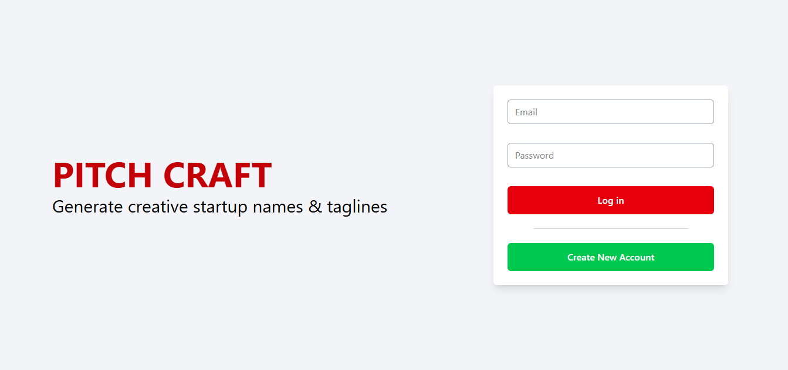
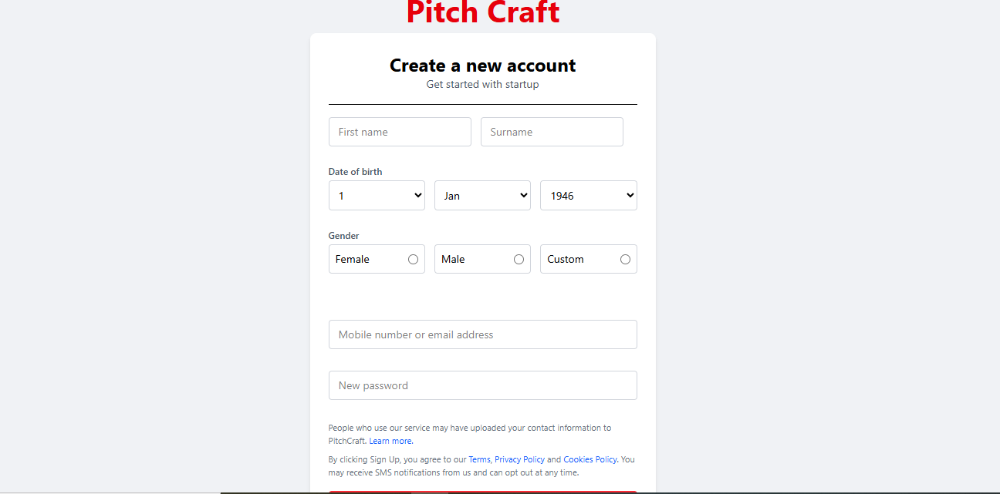
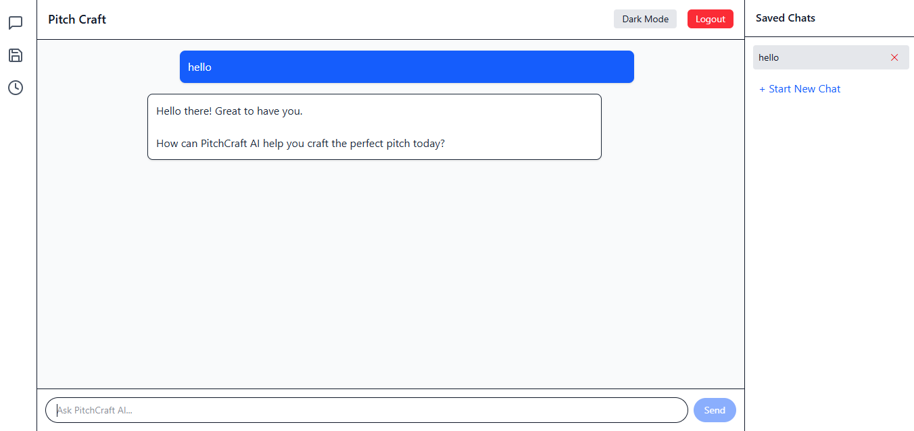
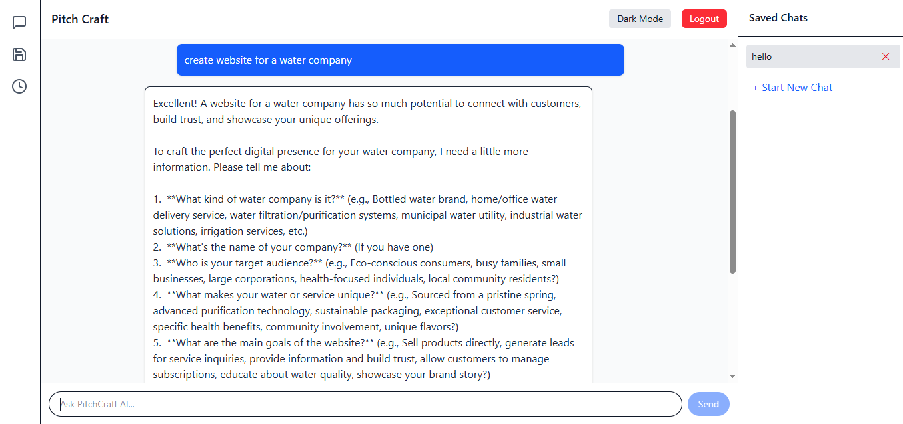
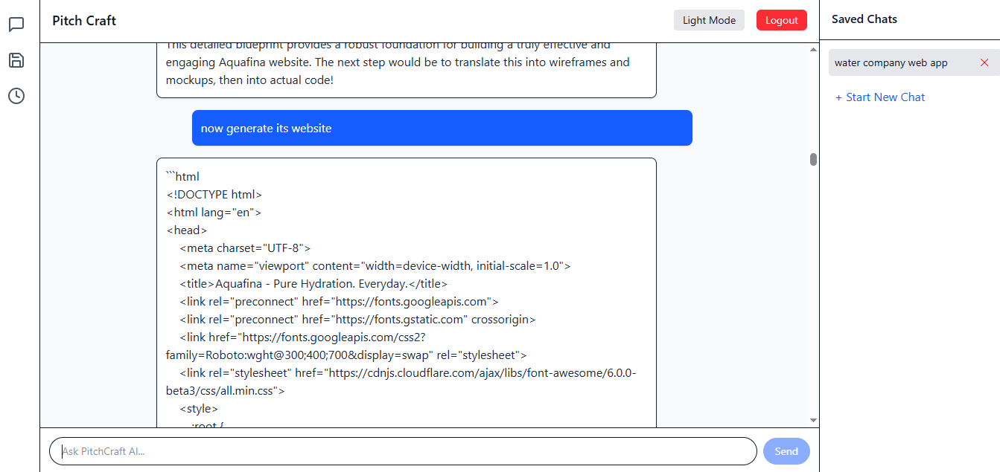
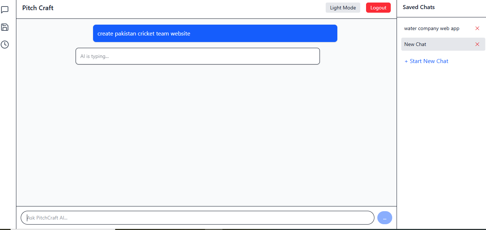
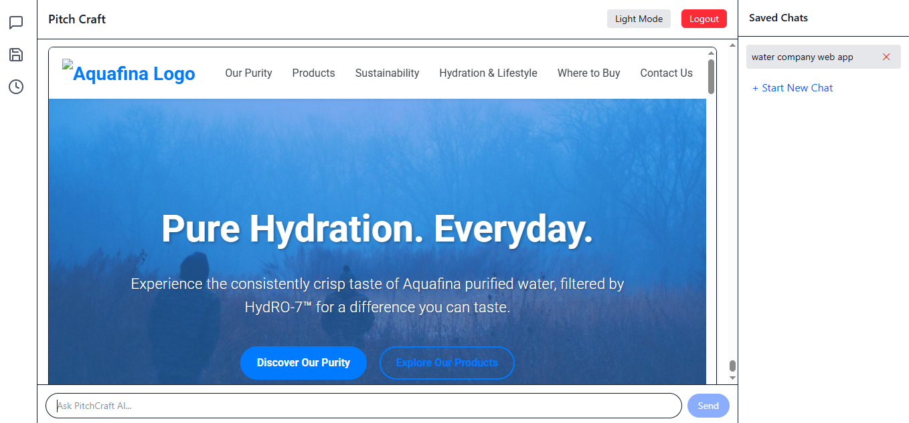
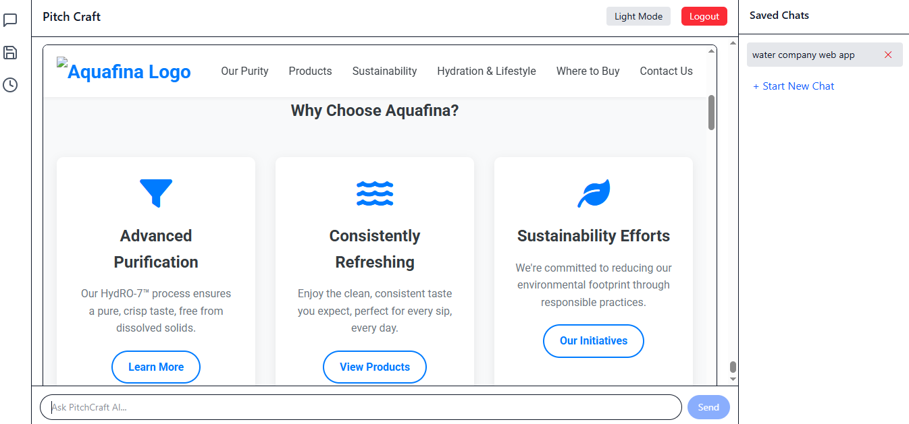
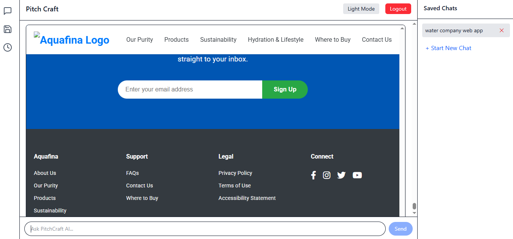
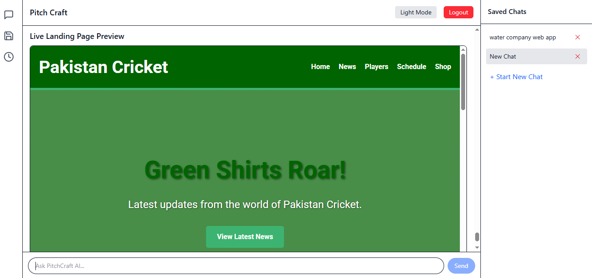

# 🤖 AI Website Generator

An AI-powered web application that allows users to generate complete, responsive websites using natural language prompts. The project is built using **React**, **Gemini API**, **Tailwind CSS**, and includes **secure authentication** using **Zod-based validation**.

Users can create chats, generate websites in real time, preview generated pages, and manage multiple AI-generated projects seamlessly.

---

## 🚀 Project Overview

The AI Website Generator provides an interactive chat-based experience where users describe the type of website they want, and the system generates fully functional HTML pages instantly. The platform supports authentication, multiple chat sessions, live previews, and clean UI using Tailwind CSS.

---

## ✨ Key Features

- 🔐 User Authentication (Login & Signup with Zod validation)
- 💬 Chat-based AI Interaction
- 🆕 Create New Chat Sessions
- ✏️ Edit Chat Names
- 🌐 AI-Generated Website Preview
- 📄 Render Full HTML Pages
- 🎨 Responsive UI with Tailwind CSS
- ⚡ Fast and interactive React frontend

---

## 🛠️ Tech Stack

- **React** – Frontend framework
- **Gemini API** – AI content generation
- **Tailwind CSS** – Styling and layout
- **JavaScript (ES6+)** – Core logic
- **Zod** – Schema-based authentication validation

---

## 📸 Application Screenshots

### 🔐 User Authentication

**Login Screen**  

**Signup Screen**  

---

### 💬 Chat Interface

**Chat Tab View**  

**Chat Tab – Alternate View**  

**Chat Tab – Expanded View**  

---

### 🆕 Chat Management

**Create New Chat**  

**Edit Chat Name**  

---

### 🌐 AI Generated Website Preview

**Generated Website – Preview 1**  

**Generated Website – Preview 2**  

**Generated Website – Preview 3**  

**Generated Website – Preview 4**  

---

## 🎯 Project Purpose

The goal of this project is to:
- Demonstrate real-world AI integration in frontend applications
- Showcase dynamic HTML generation using AI
- Provide a scalable base for AI-powered website builders
- Highlight authentication, validation, and UI best practices

---

## 📌 Disclaimer

This project is created for **educational and portfolio purposes**.  
AI-generated content and authentication logic should be enhanced before production deployment.

---

## 👨‍💻 Author

**Noman Rahim**  
Frontend Developer  

---

⭐ If you find this project useful, consider starring the repository!
